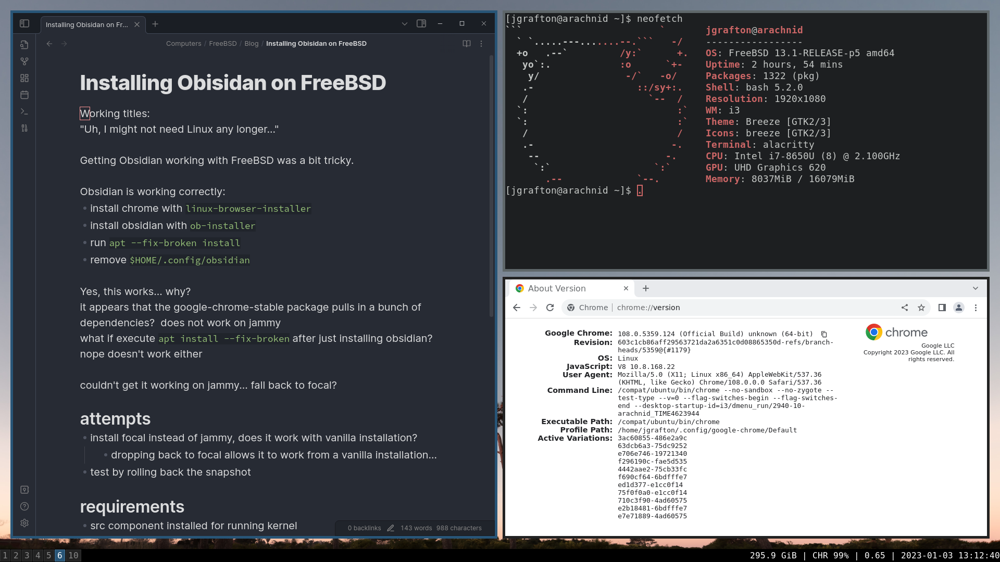
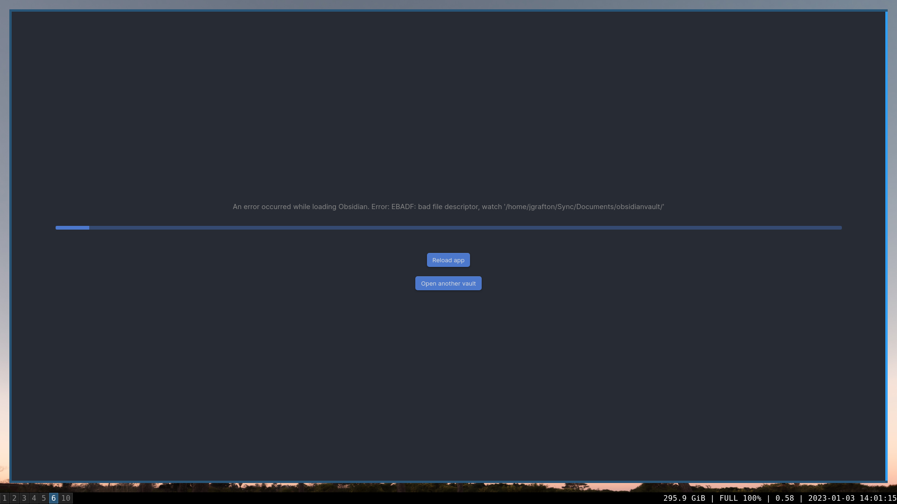

# freebsd-obsidian


This is a simple script to install the [Obsidian](https://obsidian.md)
application on a FreeBSD workstation.

This project borrows heavily from the
[linux-browser-install](https://github.com/mrclksr/linux-browser-installer.git)
repository and works in conjunction with the browsers installed by it.

## Requirements:
* FreeBSD 13.1 or 14.0
  * I've only tested on these, it *may* run on 12.  If you have luck let me know.
* amd64 cpu 
  * Obsidian only comes as an amd64 binary, thus this is a hard requirement
* 1.2GB of disk space.  Ubuntu installs a lot of packages
* src installed that matches your running kernel
  * A kmod must be compiled for your local system to support libinotify and requires the running kernel's source
* X windows
  * Various WMs and Desktops work. I've tested XFCE, i3, and KDE Plasma
  * I haven't tested this on Wayland and I assume it does not work.
* Internet connectivity for the installation

# Quick Start
## install
```
# ./ob-installer install
```

## run
```
/usr/local/bin/linux-obsidian
```

## deinstall
```
# ./ob-installer deinstall
```

## remove Ubuntu chroot completely
```
# ./ob-installer chroot delete
```

If you remove the chroot, you'll have to go through the entire install sequence again if you want to reinstall.

# Errors
If you recieve an error similiar to the following

```
An error occurred while loading Obsidian.  Error: EBADF: bad file descriptor, watch `/directory/obsidianvault`
```
Likely you don't have the linux_libbsd kernel module running.
```
# kldstat -n linux_libbsd
kldstat: can't find file linux_libbsd: No such file or directory
```
If linux_libbsd is missing, load it and set your system to load it at boot with sysrc.
```
# kldload linux_libbsd
# sysrc kld_load+=linux_libbsd
```

If you encounter any problems with this installer script please let me know by creating Issues or Pull Requests on this github repository.

# Notes
Obsidian utilizes Linux's inotify file event notification system in its core functionality.  Since FreeBSD's Linuxulator doesn't emulate inotify, Obsidian will not run on Linuxulator **out of the box**.

To emulate inotify with FreeBSD, a number of steps are required:
* bootstrap an Ubuntu chroot using debootstrap similiar to linux-browser-installer
* compile libbsd kernel module 
* compile libinotify within the chroot using gcc using libbsd hooks
* load the libbsd kernel module

The [ob-installer](ob-installer) script does each of these steps for you.

## System modifications
Using [ob-installer](ob-installer) to install Obsidian makes the following changes to your system (it's very simililar to the Chrome installation)
* Installs debootstrap and linux-steam-utils packages to your FreeBSD system
* Uses [debootstrap](https://www.freshports.org/sysutils/debootstrap/) to install an Ubuntu Focal chroot in **/compat/ubuntu**
* Compiles and loads the linux_libbsd kernel module.  Also adds **linux_libbsd** to **kld_list** in **/etc/rc.conf**
* Installs executable script **/usr/local/bin/linux-obsidian** that executes Obsidian on your workstation.
* creates an ubuntu service in **/usr/local/etc/rc.d/ubuntu** that
  * loads linuxulator kld
  * mounts linux memory backed filesystems (proc dev sys tmp)
  * sets sysctl compat.linux.emul_path to **/compat/ubuntu**
* creates a linux-obsidian.desktop file in **/usr/local/share/applications**
* symlinks obsidian icons from Ubuntu chroot into **/usr/local/share/icons**

## Why not a port?
Obsidian seems to work best with an Ubuntu chroot image that *as far as I'm aware* is unsupported within ports.  I made an effort to get Obsidian working with the CentOS 7 chroot environment already in ports to no avail.

## Syncing
I have only used POSIX filesystem compatible syncing software with Obsidian on FreeBSD, specifically [syncthing](https://syncthing.net/).  I do not know if the **Obsidian Sync** service works or not.  Please let me know the status if you get a chance to test it.